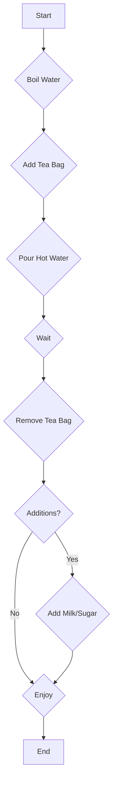

# Visualizing Algorithmic Steps with Flowcharts

Flowcharts are powerful tools for visualizing the sequence of steps and decisions within an algorithm. They provide a clear, graphical representation of how a process or program works, making it easier to understand, design, and debug.

## Understanding Flowchart Symbols

Flowcharts use a standardized set of symbols to represent different types of operations or actions. Knowing these symbols is key to "reading" and creating flowcharts.

Here are some of the most common symbols:

| Symbol         | Name           | Purpose                                      |
| :------------- | :------------- | :------------------------------------------- |
|  | Terminator     | Represents the start or end of an algorithm. |
|    | Process        | Represents a processing step or action.      |
|  | Decision       | Represents a point where a choice is made.   |
|  | Input/Output   | Represents data input or output.             |
|  | Connector      | Used to connect different parts of a flowchart. |
|        | Flowline (Arrow) | Indicates the direction of flow.             |

## Practical Example: Making Tea

Let's visualize the simple algorithm for making a cup of tea using a flowchart.

1.  **Start:** The algorithm begins.
2.  **Boil Water:** Heat water in a kettle.
3.  **Add Tea Bag:** Place a tea bag into a cup.
4.  **Pour Hot Water:** Pour the boiled water into the cup.
5.  **Wait:** Let the tea steep for a few minutes.
6.  **Remove Tea Bag:** Take the tea bag out.
7.  **Additions?** (Decision): Do you want milk or sugar?
    *   **Yes:** Add milk and/or sugar.
    *   **No:** Proceed to the next step.
8.  **Enjoy:** The tea is ready.
9.  **End:** The algorithm concludes.

**Flowchart Representation:**

## Practice Task

Create a flowchart for the algorithm that determines if a number is even or odd.

**Algorithm Steps:**

1.  Start.
2.  Get a number.
3.  Check if the number is divisible by 2 with no remainder.
4.  If yes, the number is even.
5.  If no, the number is odd.
6.  Display whether the number is even or odd.
7.  End.

## Self-Check Questions

1.  What symbol is used to indicate the beginning or end of an algorithm?
2.  When you need to make a decision in an algorithm (e.g., "Is the temperature above 20 degrees?"), which flowchart symbol would you use?
3.  What is the purpose of the arrow (flowline) symbol in a flowchart?

## Supports

- [[skills/programming/algorithms/algorithm-representation/microskills/algorithmic-step-visualization|Algorithmic step visualization]]
