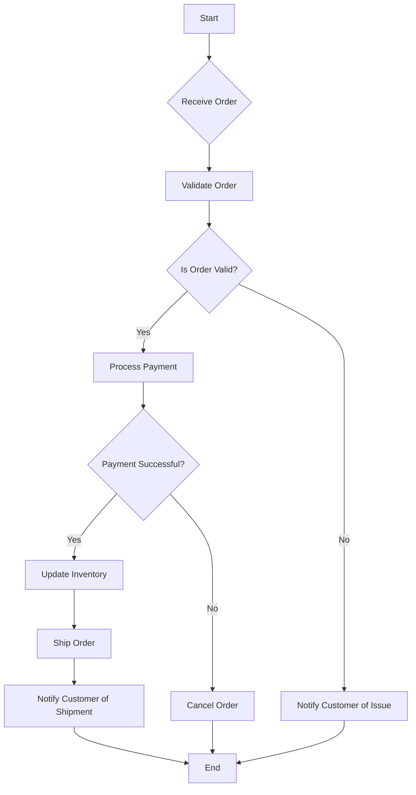

# Modeling Dynamic Behavior with UML Diagrams

In software engineering, understanding how your system *behaves* over time is just as crucial as knowing its structure. This is where dynamic behavioral diagrams in UML come into play. They help us visualize the flow of interactions and activities within our software. For this lesson, we'll focus on two key diagrams: Sequence Diagrams and Activity Diagrams.

## Sequence Diagrams: Visualizing Interactions Over Time

Sequence diagrams illustrate how objects interact with each other in a specific scenario, showing the order in which messages are passed. They are excellent for understanding the "who calls what, and when" aspect of your system's logic.

### When to Use Sequence Diagrams

*   **Understanding Use Cases:** To detail the flow of a specific use case by showing the objects involved and their interactions.
*   **Debugging Complex Interactions:** To trace the path of execution for a particular feature or bug.
*   **Designing API Calls:** To visualize how different services or components will communicate.

### Key Components of a Sequence Diagram

*   **Lifelines:** Represent an individual participant (object or component) in the interaction. They are typically depicted as a vertical dashed line with a rectangle at the top.
*   **Messages:** Arrows drawn from one lifeline to another, representing communication between objects.
    *   **Synchronous Message (Solid Arrow):** The sender waits for the receiver to complete its operation before continuing.
    *   **Asynchronous Message (Open Arrow):** The sender does not wait for the receiver.
*   **Activation Bars (Execution Specifications):** Thin rectangles drawn on lifelines, indicating the period during which an object is performing an action.
*   **Found Message:** A message sent by an object that has no lifeline shown in the diagram (e.g., a user input).
*   **Return Message (Dashed Arrow):** The sender receives a response from the receiver (optional, often implied for synchronous messages).

### Worked Example: User Login

Let's model the interaction for a user logging into a web application.

```mermaid
sequenceDiagram
    actor User
    participant WebBrowser
    participant WebServer
    participant AuthenticationService
    participant Database

    User->>WebBrowser: Enters username and password, clicks "Login"
    WebBrowser->>WebServer: POST /login (username, password)
    activate WebServer
    WebServer->>AuthenticationService: authenticate(username, password)
    activate AuthenticationService
    AuthenticationService->>Database: findUserByUsername(username)
    activate Database
    Database-->>AuthenticationService: User details or null
    deactivate Database
    alt User found
        AuthenticationService->>AuthenticationService: Verify password
        alt Password matches
            AuthenticationService-->>WebServer: Authentication success
            deactivate AuthenticationService
            WebServer-->>WebBrowser: Redirect to dashboard (HTTP 200)
        else Password mismatch
            AuthenticationService-->>WebServer: Authentication failed
            deactivate AuthenticationService
            WebServer-->>WebBrowser: Show error message (HTTP 401)
        end
    else User not found
        AuthenticationService-->>WebServer: Authentication failed
        deactivate AuthenticationService
        WebServer-->>WebBrowser: Show error message (HTTP 401)
    end
    deactivate WebServer
```

**Explanation:**

1.  The `User` interacts with the `WebBrowser`.
2.  The `WebBrowser` sends a POST request to the `WebServer`.
3.  The `WebServer` forwards the authentication request to the `AuthenticationService`.
4.  The `AuthenticationService` queries the `Database` for the user.
5.  The `Database` returns user details.
6.  Based on whether the user was found and the password matches, the `AuthenticationService` returns a success or failure status to the `WebServer`.
7.  The `WebServer` then responds to the `WebBrowser` accordingly.

## Activity Diagrams: Visualizing Workflow and Decisions

Activity diagrams are similar to flowcharts but are specifically designed for modeling the flow of control among activities. They are useful for depicting business processes, sequential steps, and decision points.

### When to Use Activity Diagrams

*   **Modeling Business Processes:** To illustrate the steps and decision logic within a business workflow.
*   **Describing Complex Algorithms:** To break down the steps of an algorithm visually.
*   **Showing Parallel Processing:** To represent activities that can occur concurrently.

### Key Components of an Activity Diagram

*   **Initial Node (Solid Circle):** Marks the start of the flow.
*   **Activity (Rounded Rectangle):** Represents a step or an action in the process.
*   **Control Flow (Arrow):** Shows the sequence of activities.
*   **Decision Node (Diamond):** Represents a point where the flow can branch based on conditions.
*   **Merge Node (Diamond):** Combines branches back into a single flow.
*   **Fork Node (Thick Bar):** Splits a flow into multiple parallel flows.
*   **Join Node (Thick Bar):** Synchronizes parallel flows back into a single flow.
*   **Final Node (Circle with Dot):** Marks the end of the workflow.

### Worked Example: Order Processing

Let's model a simplified order processing workflow.



**Explanation:**

1.  The process starts at the `Start` node.
2.  An `Receive Order` activity is followed by `Validate Order`.
3.  A `Decision Node` checks if the order is valid.
4.  If valid, `Process Payment` is initiated. If not, the customer is notified of an issue.
5.  Another `Decision Node` checks for payment success.
6.  Successful payments lead to `Update Inventory` and `Ship Order`, followed by `Notify Customer of Shipment`.
7.  Unsuccessful payments or customer notification of issues lead to order cancellation or conclusion.
8.  The process ends at the `End` node.

By mastering Sequence and Activity diagrams, you gain powerful tools for documenting and understanding the dynamic behavior of your software, contributing significantly to effective design documentation.

## Supports

- [[skills/programming/software-engineering/software-engineering/microskills/dynamic-behavioral-diagrams|Dynamic Behavioral Diagrams]]
