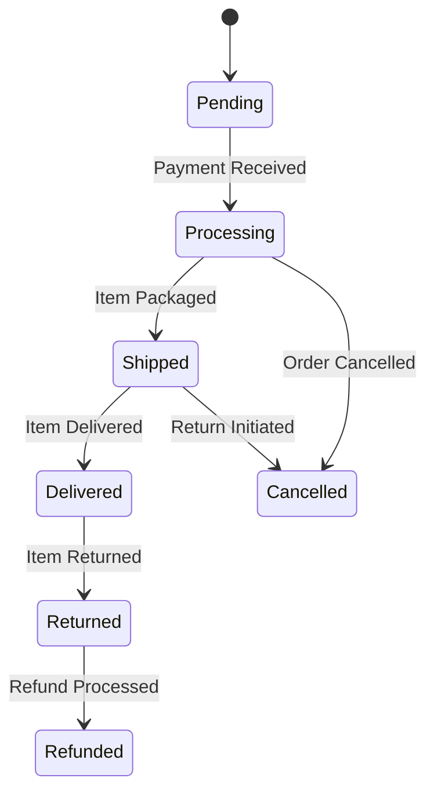

# Understanding Dynamic Behavior in UML

In UML, the way a system *behaves* over time is just as important as its structure. Dynamic behavior diagrams help us visualize processes, interactions, and changes within a system. Understanding these diagrams is crucial for grasping how a system functions from a user's or another system's perspective.

## What is Dynamic Behavior Representation?

Dynamic behavior in UML refers to how a system's components interact and change state in response to events or stimuli. These diagrams focus on the *flow* of control and data, showing sequences of operations, state transitions, and the collaboration of objects.

Think of it like a movie versus a blueprint. A blueprint shows the rooms, walls, and electrical wiring of a house (static structure). A movie shows how people move through the house, how lights turn on, and how appliances operate (dynamic behavior).

## Key UML Diagrams for Dynamic Behavior

Several UML diagram types are dedicated to representing dynamic behavior. We'll focus on the most common ones:

### 1. Sequence Diagrams

**Purpose:** To illustrate how objects interact with each other in a time-ordered sequence. They are excellent for showing the flow of messages between objects.

**Usage:**
*   Understanding the order of operations for a specific scenario (e.g., a user logging in).
*   Debugging complex interactions.
*   Visualizing the calls made to different services or components.

**Key Elements:**
*   **Lifelines:** Vertical dashed lines representing the existence of an object or participant over time.
*   **Activation Bars (Execution Specifications):** Rectangles on lifelines indicating the period during which an object is performing an action.
*   **Messages:** Arrows between lifelines representing communication between objects. These can be:
    *   **Synchronous:** The sender waits for the receiver to finish before continuing.
    *   **Asynchronous:** The sender continues immediately without waiting for a response.
    *   **Return:** Indicates a reply or completion of an operation.

**Example Scenario:** A user placing an order on an e-commerce website.

A simplified sequence diagram might look like this:

```
+---------------+      +-----------------+      +---------------+
|   User        |----->|   Web UI        |----->| Order Service |
+---------------+      +-----------------+      +---------------+
       |                      ^                       |
       | Submit Order         | Process Order         | Save Order
       |--------------------->|---------------------->|
                              |                       |
                              |                       v
                              |                 +---------------+
                              |                 | Database      |
                              |                 +---------------+
                              |                       ^
                              |                       |
                              |                       | Order Saved
                              |-----------------------|
```

In this example, the `User` sends a `Submit Order` message to the `Web UI`, which then sends a `Process Order` message to the `Order Service`. The `Order Service` then interacts with the `Database` to `Save Order` and receives an `Order Saved` confirmation.

### 2. Communication Diagrams (Collaboration Diagrams)

**Purpose:** Similar to sequence diagrams, but they emphasize the *relationships* between objects rather than the strict time ordering. They show how objects collaborate to achieve a certain functionality.

**Usage:**
*   Understanding how objects are connected and interact.
*   Focusing on the roles objects play in a collaboration.

**Key Elements:**
*   **Objects/Participants:** Shown as icons or rectangles.
*   **Links:** Lines connecting objects, representing associations or communication paths.
*   **Messages:** Labeled arrows on the links, often with sequence numbers to indicate order.

**Difference from Sequence Diagrams:** While both show interactions, sequence diagrams are more about *when* messages are sent, while communication diagrams are more about *who* is connected to *whom* and the messages exchanged.

### 3. State Machine Diagrams (Statechart Diagrams)

**Purpose:** To model the different states an object can be in throughout its lifecycle and the transitions between those states in response to events.

**Usage:**
*   Describing the behavior of individual objects that have complex lifecycles (e.g., a traffic light, an order status).
*   Modeling reactive systems or systems with distinct phases.

**Key Elements:**
*   **States:** Rounded rectangles representing a condition or situation during an object's life.
*   **Transitions:** Arrows connecting states, labeled with the event that triggers the transition.
*   **Initial State:** A solid circle indicating the starting state.
*   **Final State:** A solid circle with a border indicating the end of the lifecycle.

**Example Scenario:** The lifecycle of an online order.



This diagram shows that an order starts as `Pending`. It can move to `Processing` upon payment, then to `Shipped`, and finally `Delivered`. It can also be `Cancelled` at various stages or `Returned` after delivery, leading to a `Refunded` state.

### 4. Activity Diagrams

**Purpose:** To model the flow of activities or workflows. They are similar to flowcharts but use UML notation and can include parallel processing.

**Usage:**
*   Visualizing business processes.
*   Modeling complex algorithms or operations.
*   Showing decisions, forks, and joins in activity flow.

**Key Elements:**
*   **Initial Node:** Similar to the initial state.
*   **Activity Nodes:** Rounded rectangles representing an action.
*   **Control Flow:** Arrows showing the sequence of activities.
*   **Decision Nodes:** Diamonds representing conditional branches.
*   **Merge Nodes:** Diamonds used to bring together diverging flows.
*   **Fork Nodes:** Thick bars to split a flow into parallel branches.
*   **Join Nodes:** Thick bars to synchronize parallel branches.
*   **Activity Final Node:** Similar to the final state.

**Example Scenario:** The process of approving a loan application.

This diagram would show steps like "Receive Application," "Verify Documents," "Assess Credit Score," with decision points for approval or rejection, and potential parallel activities like "Background Check" and "Income Verification."

## Choosing the Right Diagram

*   **Sequence Diagram:** When the *order* of messages and interactions is critical.
*   **Communication Diagram:** When the *connections* and collaboration between objects are the focus.
*   **State Machine Diagram:** When an object has distinct *states* and undergoes significant changes over time.
*   **Activity Diagram:** When you need to model *workflows*, business processes, or complex sequences of actions with branching and parallelism.

By understanding these dynamic behavior diagrams, you gain a powerful toolkit for visualizing and communicating how systems actually *work* at a functional level.

## Supports

- [[skills/programming/software-engineering/uml-modeling/microskills/dynamic-behavior-representation|Dynamic Behavior Representation]]
