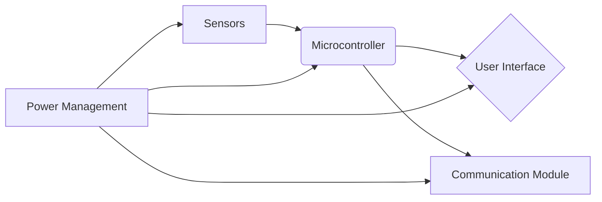

# Creating Foundational System-Level Designs

This lesson focuses on the practical application of system-level design principles to create the initial blueprint for a computer engineering system. We'll explore how to translate a problem statement into a conceptual architecture, considering both hardware and software components.

## Understanding System-Level Design

System-level design is about building the big picture. It's not about writing individual lines of code or choosing a specific capacitor; it's about defining how different parts of a system will work together to achieve a goal. Think of it as an architect's initial sketch of a building before an engineer designs the electrical wiring or plumbing.

Key aspects include:

*   **Defining system boundaries:** What is included in the system, and what is external?
*   **Identifying major components:** What are the primary functional blocks (e.g., sensors, processors, storage, user interfaces)?
*   **Defining interfaces:** How will these components communicate with each other?
*   **Considering non-functional requirements:** How will performance, reliability, security, and cost be addressed at a high level?

## A Scenario: Designing a Smart Home Environmental Monitor

Let's apply these principles to a common computer engineering problem: designing a system to monitor and report on the environmental conditions within a smart home.

**Problem Statement:** Develop a system that can measure indoor temperature, humidity, and air quality (e.g., CO2 levels) and display this information to the user, with the ability to alert the user if conditions become unhealthy.

### Step 1: Deconstruct the Problem and Identify Core Functions

First, break down the problem into its essential functions:

1.  **Sensing:** Measure temperature, humidity, and CO2.
2.  **Processing:** Read sensor data, interpret it, and determine if thresholds are exceeded.
3.  **Display/Output:** Show the current environmental readings to the user.
4.  **Alerting:** Notify the user when unhealthy conditions are detected.

### Step 2: Identify Major Components and their Roles

Based on the core functions, we can propose initial components:

*   **Sensor Module:**
    *   **Function:** Collects raw data from the environment.
    *   **Potential Hardware:** Temperature sensor, humidity sensor, CO2 sensor.
*   **Microcontroller Unit (MCU) / Processing Core:**
    *   **Function:** Reads data from the sensor module, performs calculations, applies logic for alerts, and communicates with other components.
    *   **Potential Hardware:** An embedded processor like an ARM Cortex-M series microcontroller.
*   **User Interface (UI) Module:**
    *   **Function:** Displays current readings and system status to the user.
    *   **Potential Hardware:** A small LCD screen or an LED display.
*   **Communication Module:**
    *   **Function:** Transmits data to the UI and potentially to a cloud service or a user's mobile device. Also receives commands if any.
    *   **Potential Hardware:** Wi-Fi module (e.g., ESP8266), Bluetooth module.
*   **Power Management Module:**
    *   **Function:** Supplies power to all components.
    *   **Potential Hardware:** Battery, voltage regulators.

### Step 3: Define High-Level Interfaces

How will these components talk to each other?

*   **Sensor Module <-> MCU:**
    *   **Interface Type:** Digital (e.g., I2C, SPI) or Analog. The choice depends on the specific sensors selected. For simplicity, let's assume I2C for temperature/humidity and a dedicated digital interface for CO2.
*   **MCU <-> UI Module:**
    *   **Interface Type:** Digital (e.g., parallel or serial interface for display).
*   **MCU <-> Communication Module:**
    *   **Interface Type:** Serial (e.g., UART) for sending data and receiving commands.
*   **Power Management Module -> All Other Modules:**
    *   **Interface Type:** Power supply lines (e.g., 3.3V, 5V).

### Step 4: Create a Conceptual Architecture Diagram

A simple block diagram can visually represent the system.

**Explanation of the Diagram:**

*   Arrows indicate the flow of data or control.
*   The **Microcontroller** is at the center, coordinating activities.
*   **Sensors** feed data into the microcontroller.
*   The microcontroller sends processed data to the **User Interface** for display.
*   The microcontroller also communicates through the **Communication Module**, perhaps to send data remotely.
*   **Power Management** provides energy to all parts of the system.

### Step 5: Consider System-Level Constraints and Trade-offs (Initial Thoughts)

At this early stage, we're not making definitive choices, but we're acknowledging potential considerations:

*   **Cost:** What is the target cost for the sensor module? This influences component selection.
*   **Power Consumption:** If battery-powered, which components are most power-hungry? The communication module and display are often candidates.
*   **Accuracy:** How accurate do the temperature, humidity, and CO2 readings need to be? This guides sensor selection.
*   **Connectivity:** Does it need to connect to a local network, the internet, or just Bluetooth? This impacts the Communication Module.
*   **Scalability:** Could this design be extended to include other sensors (e.g., light, noise) in the future?

## Common Mistakes to Avoid

*   **Over-specification:** Trying to define exact component models or code implementation at this stage. Focus on the functional blocks and their interactions.
*   **Ignoring interfaces:** Not thinking about how components will communicate can lead to integration nightmares later.
*   **Forgetting non-functional requirements:** While the primary focus is on functionality, even a basic design should acknowledge potential issues like power usage or cost.
*   **Lack of clear boundaries:** Unclear what is part of the system and what isn't makes the design ambiguous.

By following these steps, you can create a foundational system-level design that serves as a solid starting point for further detailed design and implementation. This process aligns with applying system-level design principles to conceptualize a solution for a defined computer engineering problem.

## Supports

- [[skills/engineering/engineering-practices/system-design/microskills/system-level-design-creation|System-Level Design Creation]]
