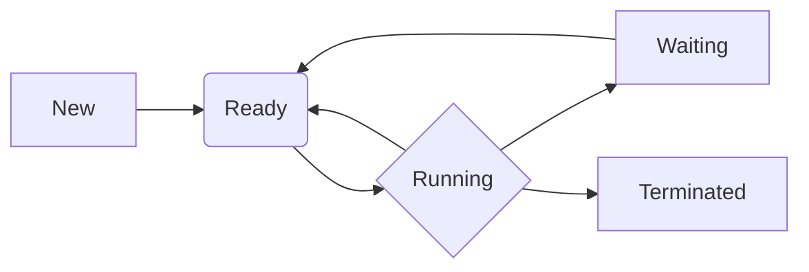

# The Journey of a Program: Understanding Process States

Welcome to this lesson, where we'll explore the dynamic life of a process within your computer's operating system. While a **program** is a set of instructions written by a developer, a **process** is the active execution of that program. Think of a program as a recipe and a process as the chef actually cooking the dish.

Understanding the different states a process can be in is crucial for grasping how your system manages tasks efficiently. These states represent the lifecycle of a process, from its creation to its eventual termination.

## The Core States of a Process

A process doesn't just run continuously from start to finish. It moves through various stages, managed by the operating system's **Process Scheduler**. Let's break down the primary states:

### 1. New (or Created)

When you launch an application (like opening a web browser or a text editor), the operating system creates a new process for it. In this state, the process is being brought into existence. The OS is allocating necessary resources, such as memory space, and performing initial setup. It's not yet ready to run but is on its way.

### 2. Ready

Once a process has been created and its initial setup is complete, it moves to the **Ready** state. This means the process has everything it needs to execute, except for the CPU. It's like a chef standing by the stove, recipe in hand, waiting for their turn to cook. The operating system keeps a list of all processes in the Ready state, and the scheduler decides which one gets the CPU next.

### 3. Running

This is where the magic happens! When the operating system's scheduler selects a process from the Ready queue, it assigns it the CPU. The process is now **Running**. Its instructions are being executed by the processor. A process can only be in the Running state on one CPU core at a time. If you have multiple CPU cores, multiple processes can be in the Running state concurrently, but each on its own core.

### 4. Waiting (or Blocked)

Processes often need to interact with external resources that are slower than the CPU. For example, a process might need to read data from a hard drive, receive input from the keyboard, or send data over a network. While waiting for these operations to complete, the process cannot continue executing. It enters the **Waiting** (or **Blocked**) state. During this time, the CPU is freed up to run other processes from the Ready queue. Once the required operation is finished (e.g., data is read from the disk), the process transitions back to the Ready state.

### 5. Terminated (or Exited)

A process reaches its end when it finishes its execution or is explicitly stopped (e.g., you close an application). When this happens, it enters the **Terminated** state. The operating system then cleans up any resources that were allocated to the process, such as memory and file handles. This makes those resources available for other processes.

## Visualizing the Process Lifecycle

To better understand how these states connect, let's look at a simplified diagram:

**Explanation of Arrows:**

*   **New -> Ready:** A process moves from New to Ready once it's initialized.
*   **Ready -> Running:** The CPU scheduler picks a process from the Ready queue and moves it to Running.
*   **Running -> Ready:** This happens when a running process is interrupted by a higher-priority process or its time slice on the CPU expires. The interrupted process goes back to the Ready queue.
*   **Running -> Waiting:** A process enters Waiting when it needs to perform an I/O operation or wait for some event.
*   **Waiting -> Ready:** Once the I/O operation completes or the event occurs, the process is ready to run again and returns to the Ready queue.
*   **Running -> Terminated:** The process finishes its execution or is signaled to stop.

## Why This Matters

Understanding these states helps us appreciate the complexity and efficiency of modern operating systems. The scheduler's job is to move processes between these states intelligently to maximize CPU utilization and provide a responsive user experience. When your computer seems slow, it's often because many processes are cycling through these states, perhaps waiting for slow I/O operations or due to intense CPU demands.

By comprehending the process lifecycle, you gain a foundational understanding of how your computer manages the software you use every day.

## Supports

- [[skills/computing/systems-infrastructure/compute-runtime/operating-systems/process-management-and-system-calls/microskills/process-lifecycle-states|Process Lifecycle States]]
