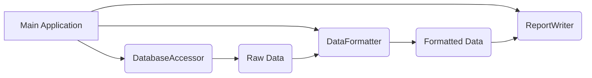

# Designing Software Modules with Clear Responsibilities

In Object-Oriented Design, a fundamental aspect of building robust and maintainable software is how we structure our modules. This lesson focuses on **System Structure Design**, specifically how to create software modules that have **clear responsibilities**. This is a crucial step in applying OO design principles and leads to systems with well-defined structures.

## Why Clear Responsibilities Matter

Imagine building a house. You wouldn't want the electrician to also be responsible for plumbing and roofing. Each trade has a specific job. Similarly, in software, modules should have a single, well-defined purpose.

Modules with clear responsibilities are:

*   **Easier to Understand:** When you look at a module, you know what it's supposed to do.
*   **Easier to Modify:** If you need to change a feature, you know which module to go to, minimizing the risk of breaking other parts of the system.
*   **Easier to Test:** You can test a module in isolation, ensuring it performs its specific task correctly.
*   **More Reusable:** A module with a clear, single responsibility is more likely to be useful in other parts of your project or even in different projects.

## Assigning Responsibilities: The Core Idea

The central idea is **separation of concerns**. Each module should focus on doing one thing and doing it well. When designing a system, think about the different tasks the software needs to perform and group related tasks into individual modules.

Consider a simple e-commerce application. We might identify responsibilities like:

*   **User Management:** Handling user registration, login, and profile updates.
*   **Product Catalog:** Storing and retrieving product information.
*   **Order Processing:** Managing shopping carts, creating orders, and handling payments.
*   **Shipping:** Calculating shipping costs and managing delivery logistics.

Each of these would likely become a distinct module (or a set of related modules).

### The "Single Responsibility Principle" (SRP)

While not exclusively about module structure, the Single Responsibility Principle (SRP) is highly relevant here. It states that:

> A module should have only one reason to change.

This means if you have to modify a module for two different reasons (e.g., to change how users log in AND to add a new payment gateway), it's a sign that the module has too many responsibilities and should be split.

## Practical Application: Designing Modules

Let's walk through a scenario. Imagine we're building a simple reporting tool that fetches data and then displays it.

**Initial Thought (Potentially problematic):**

We might initially create a single `ReportGenerator` module that does everything:

1.  Connects to the database.
2.  Fetches raw data.
3.  Formats the data into a table.
4.  Saves the table to a CSV file.

**Why this is problematic:**

*   **Database Changes:** If the database schema changes, we have to modify `ReportGenerator`.
*   **Formatting Changes:** If we want to display the data as a chart instead of a table, we have to modify `ReportGenerator`.
*   **Output Changes:** If we want to save to a PDF or an XML file, we have to modify `ReportGenerator`.

This module has multiple reasons to change.

**Applying Clear Responsibilities:**

We can decompose this into modules with clearer responsibilities:

1.  **`DatabaseAccessor` Module:**
    *   **Responsibility:** Handles all interactions with the database (connecting, querying, retrieving raw data).
    *   **Reason to Change:** Database connection details, SQL queries.

2.  **`DataFormatter` Module:**
    *   **Responsibility:** Takes raw data and transforms it into a specific presentation format (e.g., a table structure).
    *   **Reason to Change:** How data is structured for display.

3.  **`ReportWriter` Module:**
    *   **Responsibility:** Takes formatted data and writes it to a specific output format (e.g., CSV, PDF).
    *   **Reason to Change:** Output file format or storage location.

**How they interact (Conceptual):**

In this improved design:

*   If the database changes, only `DatabaseAccessor` needs modification.
*   If we want to add chart support, we create a new `ChartFormatter` module and don't touch the existing ones.
*   If we want to output to PDF, we create a `PdfWriter` and don't affect the CSV functionality.

## Key Considerations for Module Design

*   **Identify "Nouns" and "Verbs":** Often, the core concepts (nouns) in your problem domain become good candidates for modules or classes, and the actions (verbs) they perform become their responsibilities.
*   **Cohesion:** Aim for high cohesion within a module. This means the elements within a module are strongly related and work together to achieve a single purpose. Our split reporting example shows high cohesion in each new module.
*   **Coupling:** Aim for low coupling between modules. This means modules should be as independent as possible. Changes in one module should have minimal impact on others. The decomposed reporting example achieves lower coupling.

## Common Pitfalls to Avoid

*   **"God" Modules:** A single module that tries to do too much.
*   **Overlapping Responsibilities:** Two modules handling parts of the same task, leading to confusion and duplicated effort.
*   **Tight Coupling:** Modules that are too dependent on each other's internal details.

By consciously thinking about assigning clear responsibilities to your software modules, you are building a strong foundation for maintainable, scalable, and understandable object-oriented systems. This practice directly supports the goal of designing software modules with clear responsibilities.

## Supports

- [[skills/computing/software-engineering/software-design/object-oriented-design/microskills/system-structure-design|System Structure Design]]
