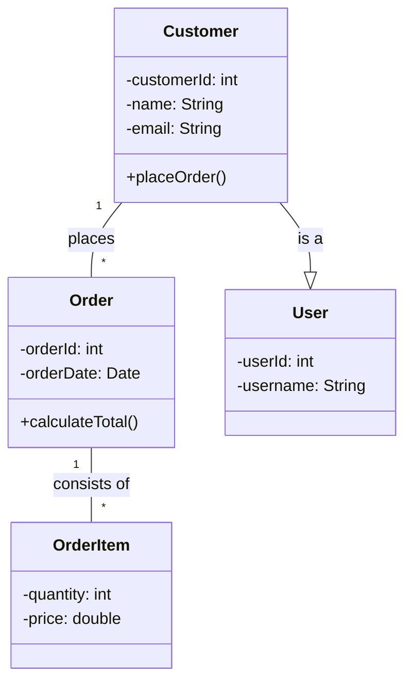

# Understanding Static Structural Diagrams in UML

This lesson focuses on **static structural diagrams** within Unified Modeling Language (UML). These diagrams are crucial for documenting the fundamental building blocks of a software system and how they relate to each other. We will explore two key types: **Class Diagrams** and **Component Diagrams**.

## Why Static Structural Diagrams?

When designing software, understanding its structure is as important as understanding its behavior. Static structural diagrams provide a blueprint of your system, showing:

*   **What are the main entities (classes, components) in your system?**
*   **What are their responsibilities and attributes?**
*   **How do these entities relate to each other (e.g., inheritance, association, dependency)?**

This clear documentation helps teams collaborate, identify potential design issues early, and serves as a reliable reference throughout the software development lifecycle.

## Class Diagrams: The Building Blocks

Class diagrams are arguably the most common UML diagram. They model the static structure of a system by showing classes, their attributes (data), operations (methods), and the relationships between these classes.

### Key Elements of a Class Diagram:

A class is typically represented as a rectangle divided into three compartments:

1.  **Class Name:** The name of the class.
2.  **Attributes:** Data members or properties of the class.
3.  **Operations:** Methods or functions that the class can perform.

**Example:**

```
+---------------------+
|      Customer       |
+---------------------+
| - customerId: int   |
| - name: String      |
| - email: String     |
+---------------------+
| + placeOrder()      |
| + updateProfile()   |
+---------------------+
```

In this example, `Customer` is a class with attributes `customerId`, `name`, and `email`, and operations `placeOrder()` and `updateProfile()`. The `-` prefix indicates private visibility, and `+` indicates public visibility.

### Relationships in Class Diagrams:

*   **Association:** Represents a general relationship between classes. It shows that objects of one class are connected to objects of another.
    *   **Aggregation:** A "has-a" relationship where one class is composed of other classes, but the composed classes can exist independently. Represented by an open diamond.
    *   **Composition:** A stronger "owns-a" relationship where the composed class cannot exist without the composite class. Represented by a filled diamond.
*   **Inheritance (Generalization):** A "is-a" relationship where one class inherits properties and behaviors from another (parent) class. Represented by a hollow arrow pointing to the parent class.
*   **Dependency:** A relationship where one class depends on another. A change in one class may affect the other. Represented by a dashed arrow.

**Example (showing relationships):**

Imagine an e-commerce system. A `Customer` might *place* `Order`s. An `Order` *consists of* `OrderItem`s. A `Customer` *is a type of* `User`.



**Mistakes to Avoid:**

*   **Overly detailed attributes:** Don't list every single data point if it's not essential for understanding the core structure.
*   **Too many relationships:** Focus on the most significant relationships that define the system's architecture.
*   **Confusing aggregation with composition:** Understand the lifetime dependencies between classes.

## Component Diagrams: The System's Parts

Component diagrams focus on the physical structure of the system, illustrating how software components are organized and their dependencies. They represent the modularity of the system.

### Key Elements of a Component Diagram:

*   **Component:** A self-contained unit of software that provides a specific set of functionalities. Represented by a rectangle with a small rectangle icon on the left, or just a rectangle with the stereotype `<<component>>`.
*   **Interface:** A contract that defines a set of operations that a component can provide (provided interface) or requires from another component (required interface). Represented by a circle (for provided) or a semi-circle (for required).
*   **Dependency:** Shows that a component relies on another component or interface. Represented by a dashed arrow.

**Example:**

Consider a web application with a UI layer, a business logic layer, and a data access layer.

```mermaid
%%{init: {'theme': 'base', 'themeVariables': { 'primaryColor': '#287287', 'primaryTextColor': '#fff'}}}%%
componentDiagram
    [Web UI] --|> [User Interface Service] : <<uses>>
    [User Interface Service] --|> [Business Logic Service] : <<uses>>
    [Business Logic Service] --|> [Data Access Service] : <<uses>>
    [Business Logic Service] --> Logger : <<uses>>

    [User Interface Service] : <<component>>
    [Business Logic Service] : <<component>>
    [Data Access Service] : <<component>>
    [Logger] : <<component>>

    interface "UI Service" as UI_Service_Impl
    interface "Business Logic" as BL_Service_Impl
    interface "Data Access" as DA_Service_Impl

    [User Interface Service] .. UI_Service_Impl : <<provides>>
    [Business Logic Service] .. BL_Service_Impl : <<provides>>
    [Data Access Service] .. DA_Service_Impl : <<provides>>

    [Web UI] .. UI_Service_Impl : <<uses>>
    [Business Logic Service] .. BL_Service_Impl : <<uses>>
    [Data Access Service] .. DA_Service_Impl : <<uses>>
```

In this diagram:

*   `[Web UI]`, `[User Interface Service]`, `[Business Logic Service]`, `[Data Access Service]`, and `[Logger]` are components.
*   The arrows indicate dependencies or usage.
*   Interfaces like `"UI Service"` define what the services offer or require.

**When to Use Component Diagrams:**

*   To visualize the modular architecture of a system.
*   To show the dependencies between different parts of the software.
*   To understand how components can be swapped or reused.

## Conclusion

Class diagrams and component diagrams are foundational static structural diagrams in UML. Class diagrams detail the object-oriented structure (classes, attributes, methods, relationships), while component diagrams depict the physical organization and interdependencies of system modules. Mastering these diagrams will significantly enhance your ability to design, document, and communicate software architecture effectively.

## Supports

- [[skills/computing/software-engineering/software-practices/software-engineering/microskills/static-structural-diagrams|Static Structural Diagrams]]
