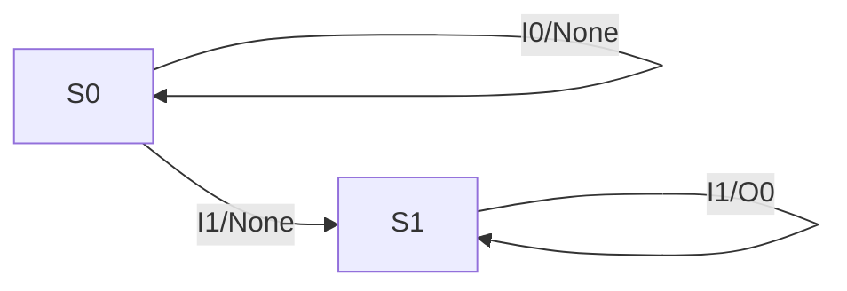

# Understanding State Machine Response to Input Conditions

In sequential logic design, state machines are fundamental. They remember past inputs and change their behavior accordingly. This lesson focuses on how a state machine *responds* to different input sequences, a key aspect of analyzing its overall behavior.

## What is an Input Condition?

An input condition refers to the specific value or combination of values that the input signals to the state machine take at any given time. These inputs are the triggers that cause the state machine to transition from one state to another, or to produce an output.

## How Input Conditions Drive State Machine Behavior

A state machine's behavior is defined by its transitions and outputs, which are directly dictated by its current state and the current input condition. This relationship is typically represented in a **state transition table** or a **state transition diagram**.

### State Transition Table

A state transition table systematically lists all possible combinations of current states and input conditions, and shows the next state and output for each combination.

Let's consider a simple vending machine that dispenses a drink after receiving 50 cents. It has two states:
*   **S0**: Waiting for money (initial state)
*   **S1**: 50 cents received, ready to dispense

The inputs are:
*   **I0**: Insert 25 cents
*   **I1**: Insert 50 cents

The outputs are:
*   **O0**: Dispense drink

Here's a state transition table:

| Current State | Input Condition | Next State | Output |
| :------------ | :-------------- | :--------- | :----- |
| S0            | I0 (25 cents)   | S0         | None   |
| S0            | I1 (50 cents)   | S1         | None   |
| S1            | I0 (25 cents)   | S1         | Dispense Drink (O0) |
| S1            | I1 (50 cents)   | S1         | Dispense Drink (O0) |

**Analysis of Input Conditions:**

*   When the machine is in **S0** (waiting for money):
    *   If the input is **I0** (25 cents), it remains in **S0**. It needs more money.
    *   If the input is **I1** (50 cents), it transitions to **S1**, indicating enough money has been inserted.
*   When the machine is in **S1** (50 cents received):
    *   If the input is **I0** (25 cents), it stays in **S1** and dispenses a drink (O0). This might represent an option to add more money or a slight malfunction in a real-world scenario, but for this simple model, it triggers the output.
    *   If the input is **I1** (50 cents), it also stays in **S1** and dispenses a drink (O0).

### State Transition Diagram

A state transition diagram uses circles to represent states and arrows to represent transitions. The arrows are labeled with the input condition that causes the transition and the output produced (if any).

In this diagram:
*   `S0` and `S1` are the states.
*   Arrows show the possible movements between states.
*   Labels like `I0/None` mean "on input I0, produce output None".
*   Labels like `I0/O0` mean "on input I0, produce output O0".

**Interpreting the Diagram:**

*   From **S0**, an input of `I0` loops back to `S0` with no output. An input of `I1` moves to `S1` with no output.
*   From **S1**, both `I0` and `I1` inputs cause the machine to stay in `S1` and produce the `O0` output (dispense drink).

## Tracing State Machine Behavior with Input Sequences

To analyze the behavior of a state machine, we often trace its response to a specific sequence of inputs.

**Scenario:** The vending machine starts in S0. What happens if the input sequence is: **I0, I0, I1, I0**?

1.  **Start State:** S0
2.  **Input 1: I0**
    *   Current State: S0
    *   Input: I0
    *   Next State: S0 (from table/diagram)
    *   Output: None
3.  **Input 2: I0**
    *   Current State: S0
    *   Input: I0
    *   Next State: S0
    *   Output: None
4.  **Input 3: I1**
    *   Current State: S0
    *   Input: I1
    *   Next State: S1
    *   Output: None
5.  **Input 4: I0**
    *   Current State: S1
    *   Input: I0
    *   Next State: S1
    *   Output: O0 (Dispense Drink)

**Conclusion for this sequence:** The machine remains in its initial state, waiting for money, after the first two 25-cent insertions. The 50-cent insertion moves it to the dispensing state. The final 25-cent insertion triggers a drink dispense while keeping it in the dispensing state.

## Common Mistakes to Avoid

*   **Confusing State and Input:** Remember that the *current state* combined with the *current input* determines the *next state* and *output*.
*   **Ignoring Outputs:** Don't just focus on state transitions; outputs are crucial for understanding what the machine *does*.
*   **Incorrectly Interpreting Complex Inputs:** For state machines with multiple input signals, ensure you correctly evaluate the *combination* of inputs as a single input condition.

By carefully analyzing how different input conditions drive transitions and produce outputs from each state, you can thoroughly understand and predict the behavior of any state machine.

## Supports

- [[skills/computing/hardware-embedded/digital-logic/sequential-logic-design/microskills/input-condition-response|Input Condition Response]]
