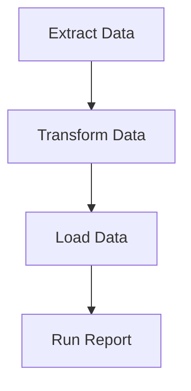

# Directed Acyclic Graphs (DAGs) in Apache Airflow

In Apache Airflow, workflows are represented as Directed Acyclic Graphs (DAGs). Understanding what a DAG is is fundamental to building and managing your data pipelines.

## What is a DAG?

A DAG is a collection of tasks you want to run, organized in a way that reflects their relationships and dependencies. Let's break down the terms:

*   **Directed:** This means the tasks have a clear direction. A task can only run after its upstream (preceding) dependencies have successfully completed. The flow of execution is not reversible.
*   **Acyclic:** This signifies that there are no loops. A task cannot depend on itself, directly or indirectly. This prevents infinite execution cycles and ensures your workflow eventually finishes.
*   **Graph:** This refers to a collection of nodes (tasks) connected by edges (dependencies).

Think of it like a recipe. You can't bake a cake (task C) until you've mixed the batter (task B), and you can't mix the batter until you've gathered the ingredients (task A). Task A must complete before Task B, and Task B before Task C. There's no way for Task C to somehow lead back to Task A.

## Practical Example: Data Processing Pipeline

Imagine you have a data pipeline that needs to:

1.  **Extract** data from a source.
2.  **Transform** the extracted data (e.g., clean, aggregate).
3.  **Load** the transformed data into a data warehouse.
4.  **Run a report** based on the loaded data.

This can be visualized as a DAG:

In this DAG:

*   `Extract Data` is the starting point.
*   `Transform Data` depends on `Extract Data`.
*   `Load Data` depends on `Transform Data`.
*   `Run Report` depends on `Load Data`.

Airflow uses this DAG structure to schedule and execute your tasks in the correct order, ensuring that dependencies are met before a task begins.

## Practice Task

Create a simple, conceptual DAG for a social media post-scheduling system. The system should:

1.  Fetch trending topics.
2.  Generate content based on a trending topic.
3.  Approve the generated content (this could be a manual step or an automated check).
4.  Schedule the approved content for posting.

Describe the tasks and their dependencies, representing them as a DAG.

## Self-Check Questions

1.  What does "directed" mean in the context of a DAG in Airflow?
2.  Why is it important for a DAG to be "acyclic"?
3.  If Task B depends on Task A, which task is considered upstream and which is downstream?

## Supports

- [[skills/computing/data-ai/data-engineering-platforms/apache-airflow/microskills/dag|DAG]]
