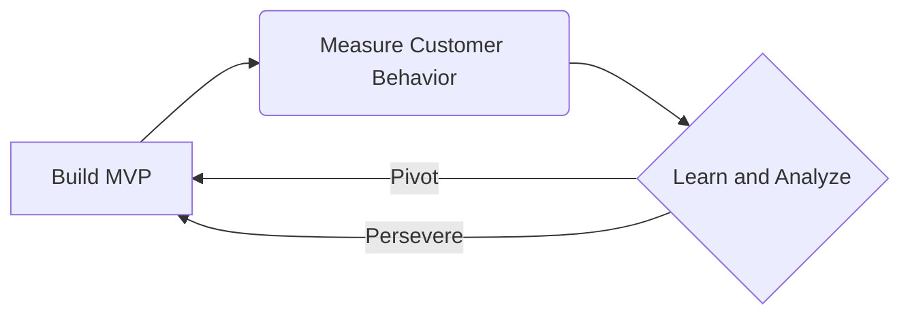

# Lean Startup Principles

Welcome! This lesson will introduce you to the core principles of the Lean Startup methodology. Understanding these principles is crucial for building successful products and businesses efficiently.

## What is Lean Startup?

Lean Startup is a methodology for developing products and businesses that aims to shorten product development cycles, reduce waste, and deliver value to customers faster. It's about learning what customers really want and iterating based on that knowledge.

## Core Tenets of Lean Startup

The Lean Startup methodology is built on several key principles. Let's break them down:

### 1. Entrepreneurs are Everywhere

This principle challenges the traditional view that startups are only found in garages. It emphasizes that anyone who is trying to create a new product or service within an organization, a nonprofit, or a government agency is an entrepreneur and can benefit from the Lean Startup approach.

### 2. Entrepreneurship is Management

Building a startup is not just about having a great idea; it's about managing a process. This involves scientific experimentation, iterative product releases, and validated learning. It requires a different kind of management than traditional businesses.

### 3. Validated Learning

This is perhaps the most critical principle. Instead of building something and hoping customers will like it, Lean Startup focuses on rigorously testing assumptions through experiments. This means learning what customers truly value, even if it contradicts your initial hypotheses. The goal is to acquire knowledge about what is most likely to lead to a sustainable business.

### 4. Innovation Accounting

Traditional accounting methods are not well-suited for startups, which are uncertain environments. Innovation accounting provides a way to measure progress when dealing with the unknown. It focuses on metrics that demonstrate learning and traction, rather than just vanity metrics (like total downloads) that don't reflect real customer engagement or revenue.

### 5. Build-Measure-Learn (BML)

This is the engine of the Lean Startup process. It's a continuous cycle of:

*   **Build:** Create a Minimum Viable Product (MVP) – the simplest version of your product that can be released to early customers. The goal is to test a core hypothesis about your business idea.
*   **Measure:** Collect data on how customers interact with your MVP. This involves using innovation accounting to track key metrics that indicate learning.
*   **Learn:** Analyze the data to understand what you've learned about your customers and your product. Based on this learning, you decide whether to "pivot" (change your strategy) or "persevere" (continue on your current path).

Let's visualize this cycle:

### What is a Minimum Viable Product (MVP)?

An MVP is the version of a new product which allows a team to collect the maximum amount of validated learning about customers with the least effort. It's not about releasing a buggy or incomplete product; it's about releasing the *core* functionality that allows you to test your riskiest assumptions.

**Example:** If you believe customers want a meal delivery service for exotic ingredients, your MVP might be a simple website where customers can order specific items, and you manually source and deliver them for a small group of early adopters. This tests if there's actual demand before you invest heavily in logistics and inventory.

### What is Pivoting?

A pivot is a structured change of direction in strategy without a change in vision. It's a decision made after validated learning shows that the current path is not working. Pivots can involve changing the target customer segment, the core technology, the revenue model, or the customer acquisition strategy.

**Example:** If your meal delivery MVP shows that people love the *convenience* but not the specific *exotic ingredients*, you might pivot to a service offering gourmet local ingredients instead.

## Key Takeaways

*   Lean Startup is a scientific approach to building businesses and products.
*   It prioritizes learning and iteration over rigid planning.
*   The **Build-Measure-Learn** cycle is central to the process.
*   An **MVP** is essential for efficient testing.
*   **Validated learning** guides decisions, including when to **pivot**.

## Supports

- [[skills/business/entrepreneurship/lean-startup/microskills/lean-startup-principles|Lean Startup Principles]]
