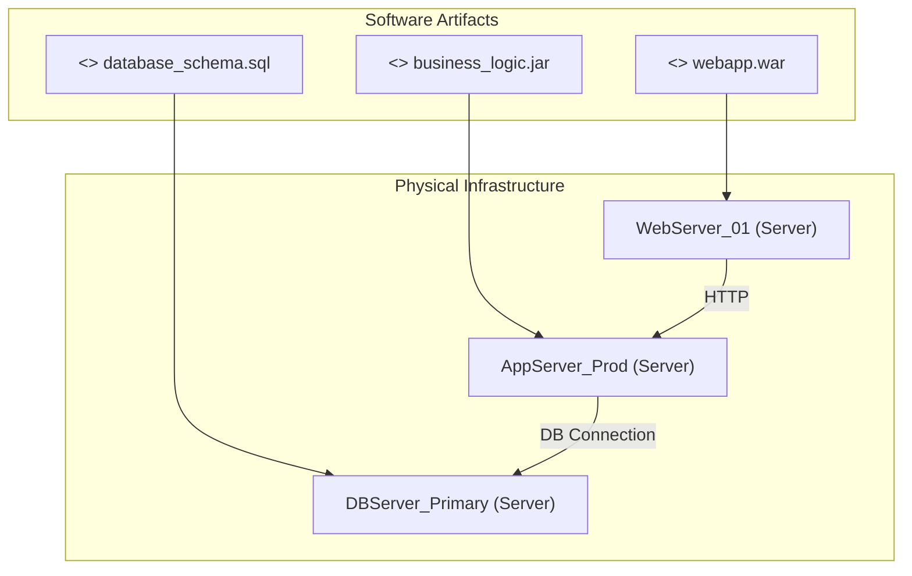

# Mapping Software to Hardware with UML

This lesson focuses on a specific application of UML diagrams: visualizing how software components are deployed and executed on physical hardware. This is crucial for understanding system architecture, resource allocation, and potential performance bottlenecks.

## Why Map Software to Hardware with UML?

When designing or analyzing complex systems, it's not enough to know what software does or how its components interact. You also need to know *where* it runs. Mapping software to hardware using UML helps us:

*   **Visualize Deployment:** Understand which software components reside on which servers, devices, or cloud instances.
*   **Identify Dependencies:** See how software relies on specific hardware resources (CPU, memory, network interfaces).
*   **Plan for Scalability:** Determine where to add more hardware to accommodate growing software demands.
*   **Troubleshoot Issues:** Pinpoint potential problems related to hardware limitations or misconfigurations affecting software performance.
*   **Communicate Architecture:** Clearly convey the physical deployment strategy to development, operations, and management teams.

## UML Diagrams for Software-Hardware Mapping

While several UML diagrams can contribute to this understanding, the **Deployment Diagram** is the primary tool for explicitly illustrating software placement on hardware.

### The Deployment Diagram

A Deployment Diagram shows the physical architecture of a system, including hardware nodes and the software components that run on them.

**Key Elements:**

*   **Nodes:** Represent physical or virtual hardware devices. They are depicted as 3D boxes.
    *   Examples: Servers, workstations, mobile devices, routers, cloud instances.
*   **Artifacts:** Represent physical pieces of information that execute on or are contained within a node. These are typically the deployable units of software. They are depicted as rectangles with a `<<artifact>>` stereotype.
    *   Examples: Executable files, libraries, databases, configuration files.
*   **Component Instances:** If you want to show a specific instance of a software component running on a node, you can use a component symbol with a `<<component>>` stereotype.
*   **Communication Paths:** Lines connecting nodes to show how they communicate.
*   **Deployment Relationships:** Arrows indicating that an artifact (software) is deployed onto a node (hardware).

### Example Scenario: A Simple Web Application

Let's consider a basic web application consisting of a web server, an application server, and a database. We want to map these onto specific hardware.

**Scenario:**

*   The web server handles incoming HTTP requests and serves static content.
*   The application server hosts the business logic and communicates with the database.
*   The database stores the application's data.

**Hardware:**

*   A high-performance web server (e.g., `WebServer_01`).
*   An application server (e.g., `AppServer_Prod`).
*   A dedicated database server (e.g., `DBServer_Primary`).

**Software Components (Artifacts):**

*   `webapp.war` (web application archive)
*   `business_logic.jar` (application server component)
*   `database_schema.sql` (database definition)

**Deployment Diagram:**

Here's how we might represent this using a Deployment Diagram:

**Explanation of the Diagram:**

1.  **Nodes:** `WebServer_01`, `AppServer_Prod`, and `DBServer_Primary` are represented as nodes, indicating the physical servers where our software will run.
2.  **Artifacts:** `webapp.war`, `business_logic.jar`, and `database_schema.sql` are shown as the deployable software units.
3.  **Deployment:** The arrows from the artifacts to the nodes signify that these software artifacts are deployed onto the respective hardware nodes. For example, `webapp.war` is deployed on `WebServer_01`.
4.  **Communication:** The lines between the nodes show how these deployed components will interact. `WebServer_01` communicates with `AppServer_Prod` over HTTP, and `AppServer_Prod` connects to `DBServer_Primary` for database access.

### Applying this Skill in Practice

To apply this skill effectively:

1.  **Identify Hardware Resources:** List all the physical or virtual machines, devices, or cloud instances involved in your system. Give them clear, descriptive names.
2.  **Identify Deployable Software Units:** Determine the individual pieces of software that will be installed or run on these resources (executables, libraries, configuration files, WAR/JAR files, Docker images, etc.).
3.  **Determine Deployment Strategy:** Decide which software units will run on which hardware resources. Consider factors like performance requirements, security, availability, and resource utilization.
4.  **Construct the Deployment Diagram:** Use a UML modeling tool or even a text-based diagramming tool (like Mermaid, as shown above) to create the diagram.
    *   Represent each hardware resource as a **node**.
    *   Represent each deployable software unit as an **artifact** (or a component if you want to show running instances).
    *   Use **deployment relationships** (arrows) to connect artifacts to the nodes they are deployed on.
    *   Optionally, add **communication paths** between nodes to illustrate how the deployed software will interact.

By mastering the application of UML Deployment Diagrams for software-hardware mapping, you gain a powerful tool for understanding, designing, and communicating the physical realities of your software systems.

## Supports

- [[skills/computing/software-engineering/software-practices/uml-modeling/microskills/uml-diagram-application-for-software-mapping|UML Diagram Application for Software Mapping]]
