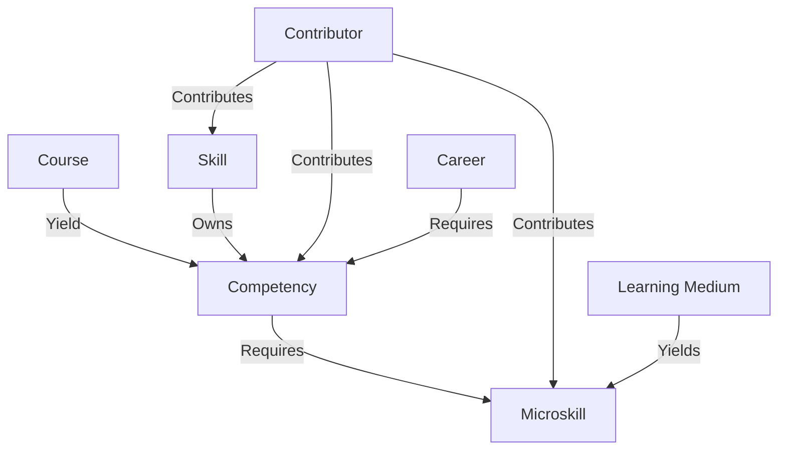

# SALMON v1.0

This ontology defines the vault schema. Treat these notes as the source of truth for how courses, careers, skills, competencies, microskills, contributors, learning media, and supporting views should be represented.

## Graph Spine

## Modules

- [[entity-types|Entity Types]]
- [[relationships|Relationships]]
- [[properties|Properties]]
- [[folder-conventions|Folder Conventions]]
- [[taxonomy-and-coverage|Taxonomy and Levels]]
- [[data-quality|Data Quality]]

## Schema Principles

- Prefer typed notes over untyped notes.
- Prefer stable frontmatter properties for machine-readable structure.
- Prefer wikilinks for human-readable graph navigation.
- Keep counts and summaries derivable from the vault instead of hardcoding them into schema notes.
- Keep paths aligned with current folder names.
- Use `courses/` for course material.
