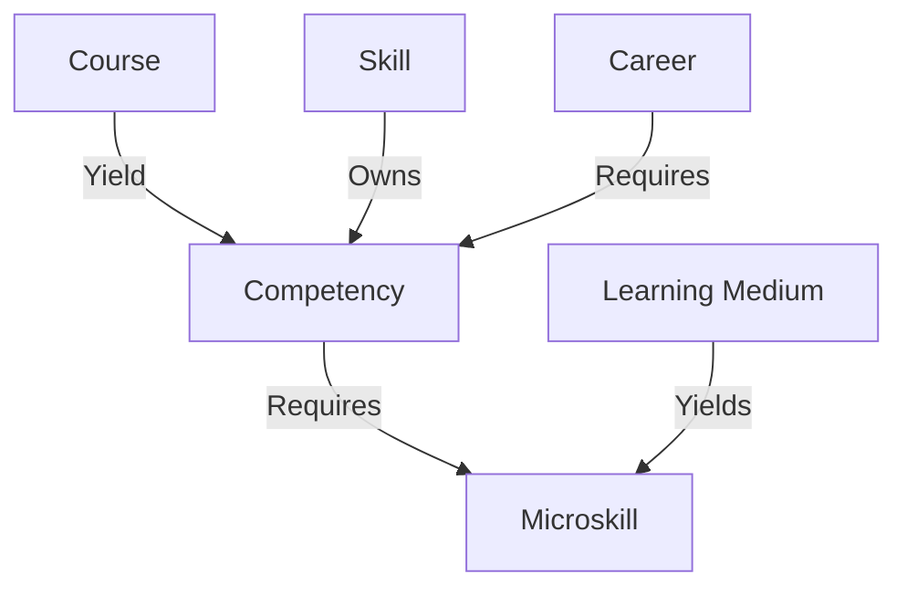

# SALMON v1.0

This ontology defines the vault schema. Treat these notes as the source of truth for how courses, careers, skills, competencies, micro-skills, learning media, and supporting views should be represented.

## Graph Spine

## Modules

- [[ontology/v1.0/entity-types|Entity Types]]
- [[ontology/v1.0/relationships|Relationships]]
- [[ontology/v1.0/properties|Properties]]
- [[ontology/v1.0/folder-conventions|Folder Conventions]]
- [[ontology/v1.0/taxonomy-and-coverage|Taxonomy and Coverage]]
- [[ontology/v1.0/data-quality|Data Quality]]

## Schema Principles

- Prefer typed notes over untyped notes.
- Prefer stable frontmatter properties for machine-readable structure.
- Prefer wikilinks for human-readable graph navigation.
- Keep counts and summaries derivable from the vault instead of hardcoding them into schema notes.
- Keep paths aligned with current folder names.
- Use `courses/` for course material.
